<!-- Hero Banner — Dark/Light mode aware -->
<picture>
  <source media="(prefers-color-scheme: dark)" srcset="./assets/hero-dark.svg">
  <source media="(prefers-color-scheme: light)" srcset="./assets/hero-light.svg">
  
</picture>

  
  
  

  

---

### 👋 Hey, I'm Amalekh.

I'm a security engineer and developer from India. I spend my time breaking into systems to understand how to build them better.

Currently, I run **[Arxec Systems](https://amalekh.arxec.systems)**, where we focus on offensive security assessments, secure web architectures, and DevSecOps. My core stack revolves around Next.js, Docker, and Cloudflare, but I'm always exploring new ways to decouple architectures and build offline-first applications.

Beyond the screen, I serve as the Technical Director for the MITS Media Club, where I manage live AV infrastructure, Dante audio routing, and DMX lighting for large-scale stage productions.

**What I'm up to:**
- 🛡️ Building hardened, zero-trust architectures at Arxec.
- 🎓 Studying B.Tech CSE (Cybersecurity) at MITS.
- 🎛️ Routing audio and lighting for live events.
- ⚡ Tinkering with headless storefronts and local sync loops.

---

### What I Work With

<table>
  <tr>
    <td align="center" width="96">
      
       <b>Next.js</b>
    </td>
    <td align="center" width="96">
      
       <b>React</b>
    </td>
    <td align="center" width="96">
      
       <b>TypeScript</b>
    </td>
    <td align="center" width="96">
      
       <b>Tailwind</b>
    </td>
    <td align="center" width="96">
      
       <b>Python</b>
    </td>
    <td align="center" width="96">
      
       <b>C</b>
    </td>
    <td align="center" width="96">
      
       <b>C++</b>
    </td>
    <td align="center" width="96">
      
       <b>Bash</b>
    </td>
    <td align="center" width="96">
      
       <b>JavaScript</b>
    </td>
  </tr>
  <tr>
    <td align="center" width="96">
      
       <b>Supabase</b>
    </td>
    <td align="center" width="96">
      
       <b>GraphQL</b>
    </td>
    <td align="center" width="96">
      
       <b>PostgreSQL</b>
    </td>
    <td align="center" width="96">
      
       <b>Redis</b>
    </td>
    <td align="center" width="96">
      
       <b>Docker</b>
    </td>
    <td align="center" width="96">
      
       <b>Cloudflare</b>
    </td>
    <td align="center" width="96">
      
       <b>Nginx</b>
    </td>
    <td align="center" width="96">
      
       <b>WordPress</b>
    </td>
    <td align="center" width="96">
      
       <b>Figma</b>
    </td>
  </tr>
  <tr>
    <td align="center" width="96">
      
       <b>Linux</b>
    </td>
    <td align="center" width="96">
      
       <b>Arch</b>
    </td>
    <td align="center" width="96">
      
       <b>Kali</b>
    </td>
    <td align="center" width="96">
      
       <b>RPi</b>
    </td>
    <td align="center" width="96">
      
       <b>Neovim</b>
    </td>
    <td align="center" width="96">
      
       <b>Git</b>
    </td>
    <td align="center" width="96">
      
       <b>GitHub</b>
    </td>
    <td align="center" width="96">
      
       <b>Postman</b>
    </td>
    <td align="center" width="96">
      
       <b>HTML</b>
    </td>
  </tr>
</table>

---

### Featured Work

<table>
  <tr>
    <td width="50%" valign="top">
      <h4>🛡️ Arxec Systems</h4>
      
Enterprise offensive security assessments, automated vulnerability scanning pipelines, zero-trust client infrastructure, and DevSecOps deployment automation.

      

        
        
        
        
        
      

    </td>
    <td width="50%" valign="top">
      <h4>⚡ Slingd Commerce</h4>
      
Decoupled headless storefront — Next.js frontend with custom WordPress GraphQL backend proxy cache and automated Google Merchant Center catalog sync.

      

        
        
        
        
      

    </td>
  </tr>
  <tr>
    <td width="50%" valign="top">
      <h4>🍽️ Elay POS & KDS</h4>
      
Offline-first restaurant management system with resilient local synchronization loops — guaranteed zero order loss during broadband network drops.

      

        
        
        
        
      

    </td>
    <td width="50%" valign="top">
      <h4>🌐 Homelab Zero Trust</h4>
      
Raspberry Pi cluster with automatic failover between fiber and 4G cellular via Cloudflare Tunnels. Zero open inbound firewall ports.

      

        
        
        
        
      

    </td>
  </tr>
  <tr>
    <td width="50%" valign="top">
      <h4>🎛️ MITS Stage AV Matrix</h4>
      
Technical direction for multi-thousand attendee productions — DMX 512 stage automation, Dante digital audio routing, Class-D power distribution.

      

        
        
        
      

    </td>
    <td width="50%" valign="top">
      <h4>📡 Command Center</h4>
      
High-performance DevSecOps portfolio dashboard with Next.js and Convex — real-time WebSocket sync across Treasury, Academy, and Logistics modules.

      

        
        
        
        
      

    </td>
  </tr>
</table>

---

### Contribution Snake

<picture>
  <source media="(prefers-color-scheme: dark)" srcset="https://raw.githubusercontent.com/Amalekh-Biju/Amalekh-Biju/output/github-contribution-grid-snake-dark.svg">
  <source media="(prefers-color-scheme: light)" srcset="https://raw.githubusercontent.com/Amalekh-Biju/Amalekh-Biju/output/github-contribution-grid-snake.svg">
  
</picture>

---

### GitHub Stats

  
  

  <a href="https://next.ossinsight.io/widgets/official/compose-user-dashboard-stats?user_id=97168630" target="_blank">
    <picture>
      <source media="(prefers-color-scheme: dark)" srcset="https://next.ossinsight.io/widgets/official/compose-user-dashboard-stats/thumbnail.png?user_id=97168630&image_size=auto&color_scheme=dark" width="771" height="auto">
      
    </picture>
  </a>

  <a href="https://next.ossinsight.io/widgets/official/compose-currently-working-on?user_id=97168630&activity_type=all" target="_blank">
    <picture>
      <source media="(prefers-color-scheme: dark)" srcset="https://next.ossinsight.io/widgets/official/compose-currently-working-on/thumbnail.png?user_id=97168630&activity_type=all&image_size=auto&color_scheme=dark" width="497.5" height="auto">
      
    </picture>
  </a>

